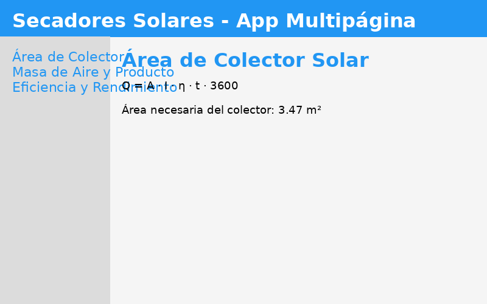

## Ejemplo de uso

Al ejecutar la app, verás un menú lateral con tres apartados:

- **Área de Colector Solar**: Ingresa los valores de energía requerida, irradiancia, eficiencia y tiempo. Obtendrás el área necesaria del colector.
- **Masa de Aire y Producto**: Ingresa la masa de producto y las humedades inicial y final. Obtendrás la masa de agua a eliminar.
- **Eficiencia y Rendimiento**: Ingresa la energía útil y total recibida. Obtendrás la eficiencia del secador.

Cada cálculo muestra la fórmula simbólica y el resultado numérico.

## Capturas de pantalla

Puedes agregar imágenes de la app en funcionamiento aquí:

```
docs/capturas/
```

Ejemplo:

# prueba-guia-sympy-secadores
## Instrucciones de uso

1. **Crear y activar el entorno virtual**
	```bash
	python3 -m venv .venv
	source .venv/bin/activate
	```

2. **Instalar dependencias**
	```bash
	pip install streamlit sympy python-docx
	```

3. **Ejecutar la aplicación Streamlit**
	```bash
	streamlit run app/main.py
	```

4. **Navegar por los apartados**
	Utiliza el menú lateral para acceder a cada cálculo: área de colector, masa de aire/producto y eficiencia/rendimiento.
Ejercicio previo a la clase de secadores solares con sympy y streamlit
