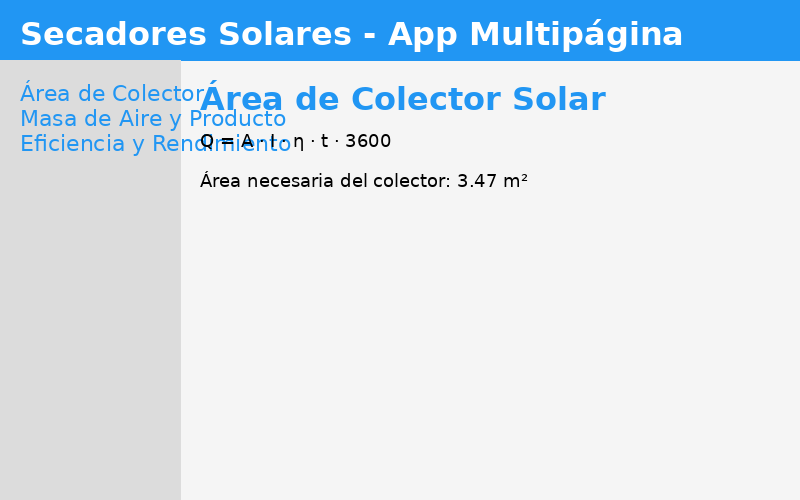

# Streamlit + SymPy App para Secadores Solares

Este proyecto implementa una aplicación multipágina en Streamlit que resuelve los tres apartados del PDF "Solar_Dryers-APENDICES.pdf" siguiendo la estructura y recomendaciones de la "Guía_Sympy_Secadores.docx".

## Estructura
- `app/` : Código fuente de la aplicación Streamlit
- `docs/` : Documentación y archivos de referencia

## Requisitos
- Python 3.12+
- Streamlit
- SymPy
- python-docx

Instalación de dependencias:
```bash
pip install streamlit sympy python-docx
```

## Ejecución
Desde la raíz del repositorio:
```bash
streamlit run app/main.py
```

## Ejemplo visual

Mockup de la app Streamlit:



## Apartados implementados
1. **Cálculo de área de colector solar**
2. **Cálculo de masa de aire y producto**
3. **Cálculo de eficiencia y rendimiento**

Cada apartado se encuentra en una página separada dentro de la app.

## Notas
- La lógica y fórmulas se basan en los apéndices del PDF y la guía DOCX.
- El usuario puede ingresar parámetros y obtener resultados simbólicos y numéricos.
